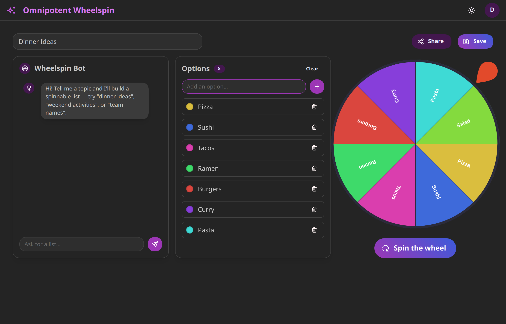
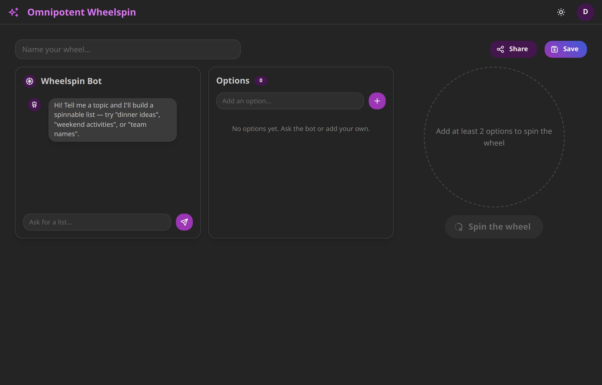
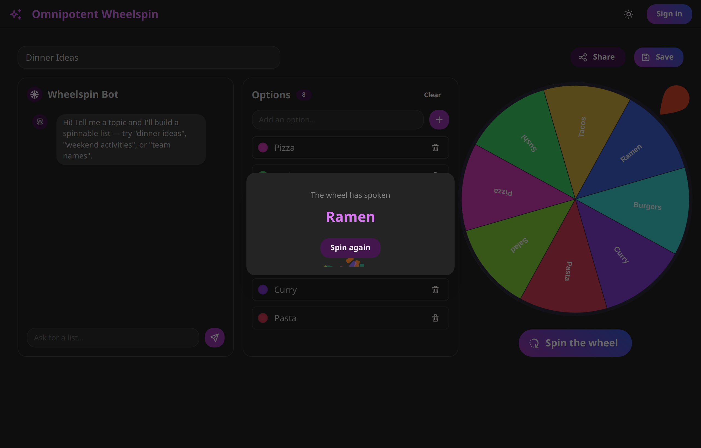
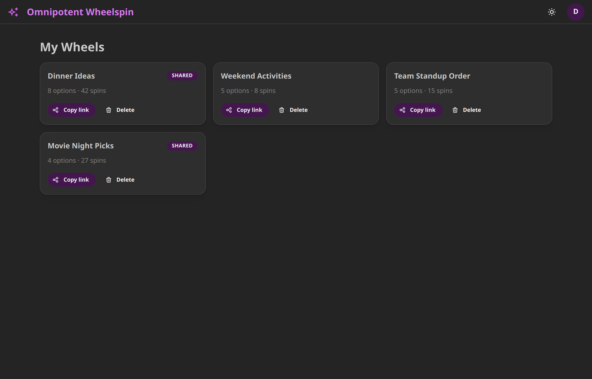
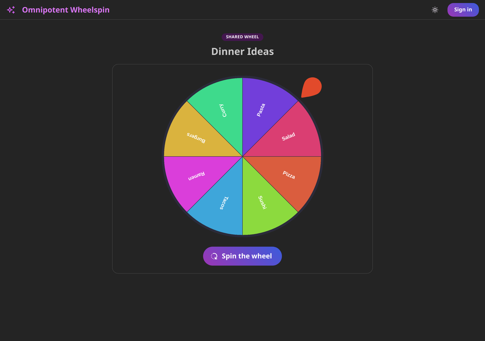
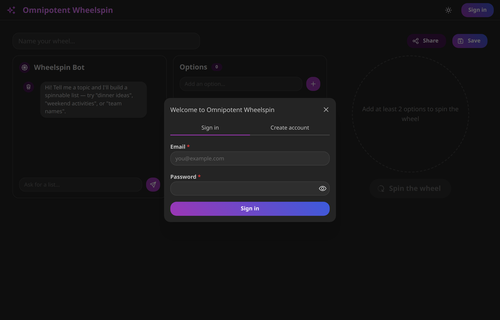
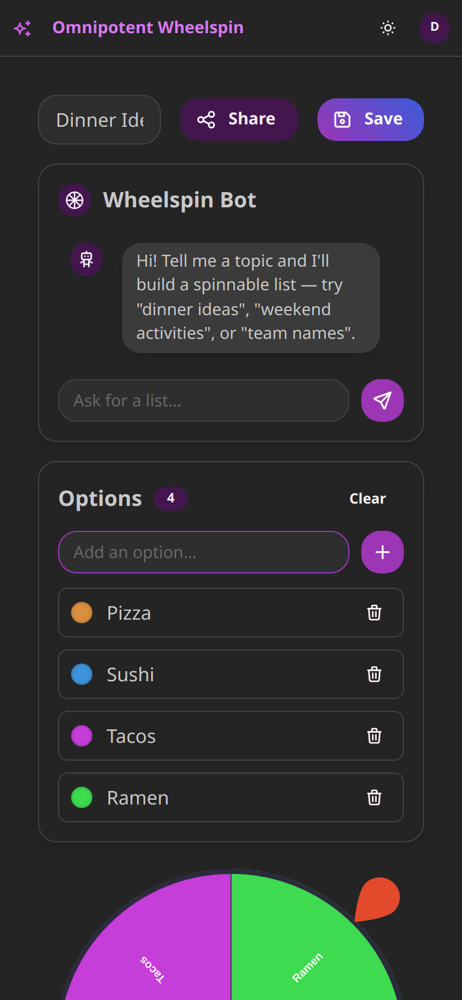

# 🎡 Omnipotent Wheelspin

**Omnipotent Wheelspin** is a delightful, AI‑powered decision‑making app. Describe
what you're deciding — _"dinner ideas"_, _"weekend activities"_, _"team names"_ — and
an AI chatbot instantly turns it into a colorful, spinnable prize wheel. Add or remove
options by hand, give the wheel a spin, and let it pick for you. Sign in to save your
wheels and share any of them with a public link so friends can spin too.

<p align="center">
  
</p>

---

## ✨ Features

- **AI list builder** — Chat with the "Wheelspin Bot" and it generates a ready‑to‑spin
  list from any topic, powered by Google Gemini.
- **Manual editing** — Add, remove, or clear options; each slice gets a distinct,
  auto‑generated color so no two wedges look alike.
- **Animated spinning wheel** — A physics‑style roulette with a winner reveal and
  confetti celebration.
- **Save your wheels** — Create an account to persist wheels to your personal dashboard.
- **Share links** — Publish any wheel to a public URL (`/w/:shareId`) that anyone can
  open and spin. Spin counts are tracked.
- **Light & dark mode** — Theme toggle built in, defaulting to a rich dark theme.
- **Fully responsive** — Works across phones, tablets, laptops, and large monitors.
- **Secure by design** — Row Level Security keeps every user's private wheels private,
  and the Gemini API key never leaves the server.

---

## 🛠️ Tech Stack

### Frontend

| Area          | Technology                                                                                      |
| ------------- | ----------------------------------------------------------------------------------------------- |
| Framework     | [React 19](https://react.dev/)                                                                  |
| Build tool    | [Vite 8](https://vite.dev/)                                                                     |
| Routing       | [React Router 7](https://reactrouter.com/)                                                      |
| UI components | [Mantine 9](https://mantine.dev/) (`@mantine/core`, `@mantine/hooks`, `@mantine/notifications`) |
| Icons         | [Tabler Icons](https://tabler.io/icons)                                                         |
| Animation     | [Framer Motion](https://www.framer.com/motion/)                                                 |
| Wheel         | [react-custom-roulette](https://www.npmjs.com/package/react-custom-roulette)                    |
| Server state  | [TanStack React Query 5](https://tanstack.com/query)                                            |

### Backend & Infrastructure

| Area                | Technology                                                                            |
| ------------------- | ------------------------------------------------------------------------------------- |
| Database & Auth     | [Supabase](https://supabase.com/) (PostgreSQL, Auth, Row Level Security)              |
| Serverless AI proxy | [Supabase Edge Functions](https://supabase.com/docs/guides/functions) (Deno)          |
| AI model            | [Google Gemini](https://ai.google.dev/) (`gemini-3.6-flash`) via the Interactions API |
| Hosting             | [Vercel](https://vercel.com/) (SPA rewrites)                                          |

### Tooling

| Area             | Technology                                                                              |
| ---------------- | --------------------------------------------------------------------------------------- |
| Linting          | [ESLint 10](https://eslint.org/) with React Hooks & React Refresh plugins               |
| Styling pipeline | [PostCSS](https://postcss.org/) with `postcss-preset-mantine` and `postcss-simple-vars` |

---

## 🏗️ Architecture Overview

```
┌────────────────────────────────────────────────────────────┐
│                    React SPA (Vite)                         │
│                                                             │
│  Pages:  Builder (/)   Dashboard (/dashboard)   Shared (/w) │
│  State:  TanStack React Query  •  AuthProvider (context)    │
└───────────────┬──────────────────────────┬─────────────────┘
                │                          │
        chat prompt/response        CRUD + auth (RLS)
                │                          │
        ┌───────▼────────┐        ┌────────▼─────────┐
        │ Supabase Edge  │        │    Supabase      │
        │ Function `chat`│        │  Postgres + Auth │
        └───────┬────────┘        └──────────────────┘
                │
        ┌───────▼────────┐
        │  Google Gemini │
        │  Interactions  │
        └────────────────┘
```

Key design decisions:

- **Data access is centralized.** Components never call the Supabase client directly.
  All reads and writes go through TanStack React Query hooks (`src/hooks/`) that wrap
  data‑access functions (`src/utils/`).
- **The AI key stays server‑side.** The browser calls a Supabase Edge Function, which
  holds the `GEMINI_API_KEY` secret and talks to Gemini. The key never ships in the
  client bundle.
- **Row Level Security enforces ownership.** A user can only see and modify their own
  wheels, while anyone can read a wheel once it's been made public via a share link.

---

## 📸 Screenshots

### Builder — the home page

Chat with the AI on the left, curate options in the middle, and spin the wheel on the right.

| Empty state                                          | With a generated wheel                                    |
| ---------------------------------------------------- | --------------------------------------------------------- |
|  |  |

### Winner reveal

Spinning the wheel picks a winner and celebrates with confetti.



### Dashboard — your saved wheels

Signed‑in users get a personal dashboard to revisit, share, or delete their wheels.



### Shared wheel

Any published wheel is reachable at a public `/w/:shareId` link — no account required to spin.



### Authentication

Email + password sign‑in and account creation via a Mantine modal.



### Responsive on mobile

The three‑panel builder stacks gracefully on small screens.

<p align="center">
  
</p>

---

## 🚀 Getting Started

### Prerequisites

- [Node.js](https://nodejs.org/) 20.19+ (or 22.12+)
- A [Supabase](https://supabase.com/) project
- A [Google Gemini](https://ai.google.dev/) API key

### 1. Install dependencies

```bash
npm install
```

### 2. Configure environment variables

Copy the example file and fill in your Supabase project credentials
(**Supabase Dashboard → Project Settings → API**):

```bash
cp .env.example .env
```

```dotenv
VITE_SUPABASE_URL=https://YOUR-PROJECT-REF.supabase.co
VITE_SUPABASE_ANON_KEY=your-anon-public-key
```

> The Gemini API key is **not** stored here — it's a server‑side secret (see below), so
> it never reaches the browser.

### 3. Set up the database

Apply the schema migration to your Supabase project (creates the `profiles` and `wheels`
tables, triggers, and Row Level Security policies):

```bash
npx supabase link --project-ref YOUR-PROJECT-REF
npx supabase db push
```

### 4. Deploy the AI Edge Function

```bash
# Store the Gemini key as a server-side secret
npx supabase secrets set GEMINI_API_KEY=your-gemini-key

# Deploy the chatbot function
npx supabase functions deploy chat
```

### 5. Run the app

```bash
npm run dev
```

The app runs at [http://localhost:5173](http://localhost:5173).

---

## 📜 Available Scripts

| Command           | Description                          |
| ----------------- | ------------------------------------ |
| `npm run dev`     | Start the Vite dev server with HMR   |
| `npm run build`   | Build the production bundle          |
| `npm run preview` | Preview the production build locally |
| `npm run lint`    | Run ESLint across the project        |

---

## 📁 Project Structure

```
.
├── public/                     # Static assets
├── src/
│   ├── App.jsx                 # App shell + routes
│   ├── main.jsx                # Providers (Mantine, React Query, Router, Auth)
│   ├── theme.js                # Mantine theme (grape primary color)
│   ├── auth/
│   │   └── AuthProvider.jsx    # Supabase auth session context
│   ├── components/
│   │   ├── Navbar.jsx          # Top bar: brand, theme toggle, account menu
│   │   ├── ChatPanel.jsx       # AI "Wheelspin Bot" chat
│   │   ├── ItemList.jsx        # Add/remove/clear wheel options
│   │   ├── WheelCanvas.jsx     # The spinning wheel + winner modal
│   │   ├── Confetti.jsx        # Winner celebration
│   │   └── AuthModal.jsx       # Sign in / create account
│   ├── pages/
│   │   ├── Builder.jsx         # Home: build + spin a wheel
│   │   ├── Dashboard.jsx       # Saved wheels for the signed-in user
│   │   └── SharedWheel.jsx     # Public wheel by share link
│   ├── hooks/                  # TanStack React Query hooks
│   └── utils/                  # Supabase client + data-access functions
├── supabase/
│   ├── config.toml
│   ├── functions/chat/         # Gemini-backed Edge Function (Deno)
│   └── migrations/             # SQL schema + RLS policies
├── docs/screenshots/           # Images used in this README
├── vercel.json                 # SPA rewrite rules
└── vite.config.js
```

---

## 🗄️ Data Model

**`profiles`** — one row per authenticated user, created automatically on signup.

**`wheels`** — a saved wheelspin. Options are stored as a JSONB array of
`{ id, label, color }` objects. Each wheel has an opaque `share_id` used for public
share links, plus a `spin_count`. Row Level Security ensures owners manage their own
wheels while anyone can read a wheel that has been made public.

---

## 🚢 Deployment

The app is configured for [Vercel](https://vercel.com/):

1. Import the repository into Vercel.
2. Add the `VITE_SUPABASE_URL` and `VITE_SUPABASE_ANON_KEY` environment variables
   (**Settings → Environment Variables**).
3. Deploy. The included `vercel.json` rewrites all routes to `index.html` so client‑side
   routing (e.g. `/w/:shareId`) works on refresh.

If the Supabase variables are missing, the app renders a clear configuration banner
instead of crashing.
